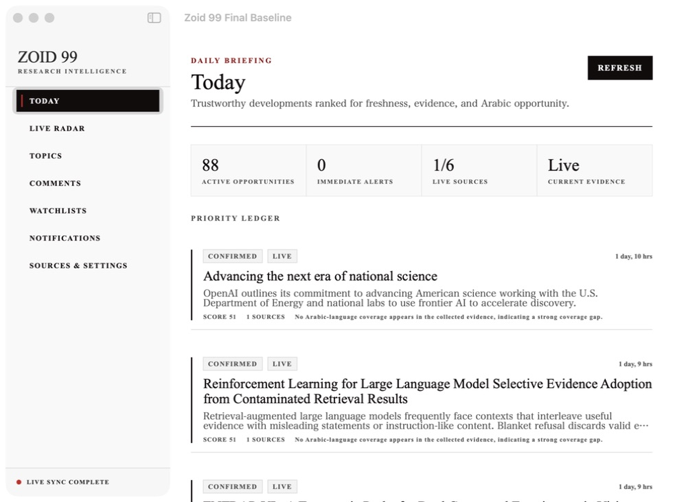

Status: ready-for-human

# Combined Production Baseline Proof

Date: 2026-07-24

Branch: `codex/zoid-99-production-baseline`

Base: `main` at `5aba082`

## Integrated inputs

| Delivery | Requested commit | Baseline commit |
| --- | --- | --- |
| Analysis pipeline | `e45dad7ee66249e2614c184afbd8c666acd4ba7e` | `7c16bc4` |
| Ingestion and synchronization | `200f5ee2a4b25a4af64dd5d6e1381bcb930adf43` | `f3648be` |
| YouTube | `0663af1` | `0d5c165` |
| Google Trends | `2195bd0` | `5d7cc44` |
| X | `958082e` | `52b6133` |
| Instagram | `2088071e2bd583ac59eb05b795db53a9a2e212de` | `f289edf` |
| Progress ledger | `84f31210f496e2ce7a56513795e6678a457e91e3` | `a304c32` |

## Combined defects fixed

Large Story Clusters are split into authenticated ingestion requests below the backend's 64 KiB body limit.

Every normalized source item remains represented after splitting, and the identified original source remains attached to each partial batch.

Story clustering now uses complete-link matching, ignores generic release words and standalone version numbers, and keeps different semantic, patch, and model minor versions separate.

## Verification

Swift: 59 tests executed, 54 passed, 5 credential-gated live tests skipped, and 0 failed.

Swift release build: passed.

Backend with local PostgreSQL: 20 tests executed, 20 passed, 0 skipped, and 0 failed.

Backend TypeScript typecheck: passed.

Backend build: passed.

Production dependency audit: 0 vulnerabilities.

`git diff --check`: passed.

Tracked-file credential scan: no private-key, provider-key, or long bearer-token patterns found.

Private single-user boundary scan: no Zoid login, signup, app-account, or user-account implementation found.

The only code match for `login` is the public GitHub Releases author field.

## Live native proof

`LIVE_SPINE_PROOF endpoint=http://127.0.0.1:8104 items=90 first=https://openai.com/index/health-in-chatgpt collectedAt=2026-07-23T22:18:06Z`

A fresh PostgreSQL database received 90 official source items and returned 88 distinct opportunities after strict clustering.

The native Today surface showed `LIVE SYNC COMPLETE`, 88 active opportunities, one of six source groups live, and current evidence marked Live.

## Unresolved live gates

YouTube requires an API key and configured reference channels, with OAuth for owned-account discovery and owned comments.

Google Trends requires approved official alpha provider access and its provider credential.

X requires an approved developer project, sufficient paid API access, and a bearer token.

Instagram requires a Meta app, a connected professional account and Page, approved scopes or review where required, and a valid access token.

Live AI interpretation requires its configured model-provider credential.

Always-on monitoring while the Mac sleeps remains an operational hosting task and is not a credential-only gate.
