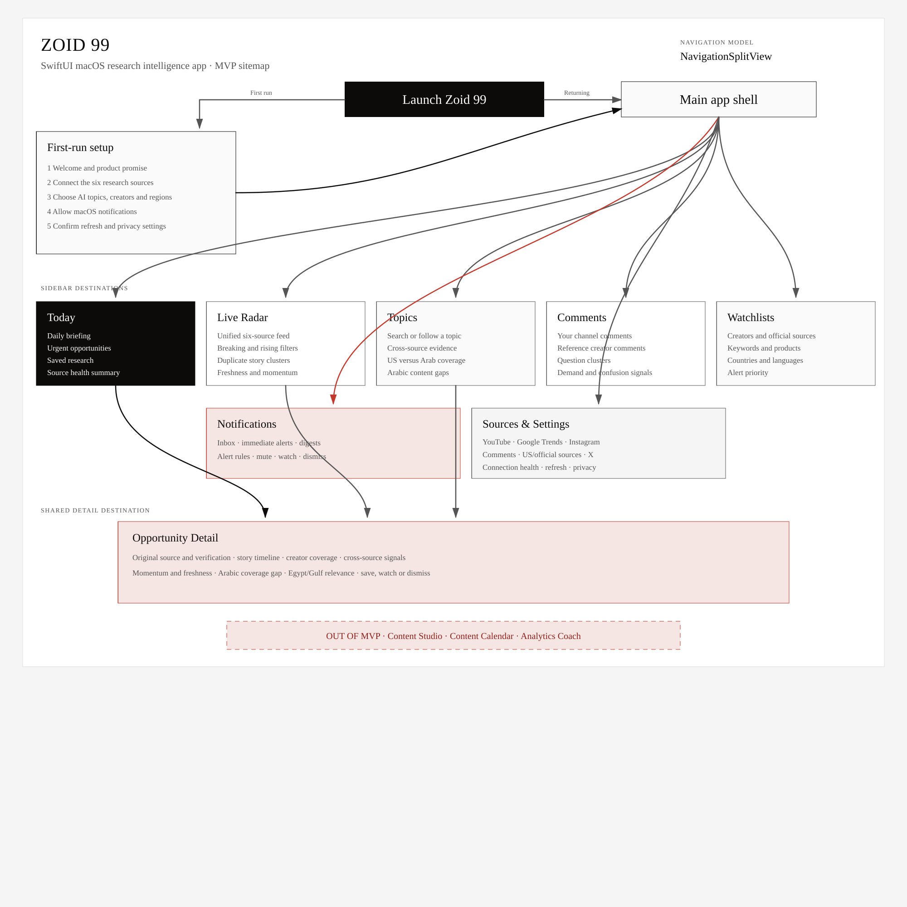

Status: ready-for-agent

# Zoid 99 Research Intelligence MVP

## Problem Statement

An Arabic AI creator needs to notice important developments as early as US creators, without manually checking many platforms throughout the day.
Relevant information is currently scattered across YouTube, Google Trends, Instagram, comments, official sources, US creators, and X.
Repeated stories, weak claims, and noisy notifications make it difficult to tell which development is real, timely, and useful for Arabic audiences.
The creator needs one macOS application that continuously gathers these signals, verifies their origin, identifies Arabic content gaps, and sends useful notifications.

## Solution

Zoid 99 will be a native SwiftUI macOS application backed by a small always-on monitoring service.
It will collect Source Items from six source groups, combine duplicates into Story Clusters, verify the original source, and create Opportunities.
Each Opportunity will show freshness, momentum, creator coverage, Arabic coverage gaps, and relevance to Egypt and Gulf countries.
The application will provide a focused Today view, Live Radar, topic research, comment research, watchlists, notifications, source management, and a shared Opportunity Detail screen.
The interface will use the canonical SUMI-E Sumi-Ink visual and motion system defined by this repository's `DESIGN.md` and `MOTION.md`.
It will stop at research and prioritization.
It will not generate scripts, manage production, publish content, or analyze published-content performance.

## Site Map



[Open the editable Excalidraw sitemap](../../docs/product/zoid-99-sitemap.excalidraw)

```text
Zoid 99
├── First-run setup
│   ├── Welcome
│   ├── Connect six source groups
│   ├── Choose topics, creators, and regions
│   ├── Allow notifications
│   └── Confirm refresh and privacy settings
└── Main app shell
    ├── Today
    ├── Live Radar
    ├── Topics
    ├── Comments
    ├── Watchlists
    ├── Notifications
    ├── Sources and Settings
    └── Opportunity Detail
```

Today, Live Radar, and Topics open the shared Opportunity Detail destination.
Content Studio, Content Calendar, and Analytics Coach are not part of this MVP.

## User Stories

1. As an Arabic AI creator, I want one application for all research signals, so that I do not need to monitor several platforms manually.
2. As an Arabic AI creator, I want important AI developments detected quickly, so that I can react while the topic is still fresh.
3. As an Arabic AI creator, I want official sources monitored, so that I can discover releases without waiting for another creator to cover them.
4. As an Arabic AI creator, I want selected US creators monitored, so that I can see what early creators are discussing.
5. As an Arabic AI creator, I want selected Arabic creators monitored, so that I can identify whether strong Arabic coverage already exists.
6. As an Arabic AI creator, I want YouTube videos and search signals collected, so that I can understand emerging viewer interest.
7. As an Arabic AI creator, I want Google Trends signals collected across selected countries, so that I can compare US, Egyptian, and Gulf interest.
8. As an Arabic AI creator, I want Instagram references collected where platform access permits, so that I can notice relevant Reel topics and formats.
9. As an Arabic AI creator, I want X accounts and keywords monitored, so that I can notice announcements and discussion before long videos appear.
10. As an Arabic AI creator, I want product releases, company blogs, research feeds, and trusted AI sources monitored, so that creator coverage is not my only discovery path.
11. As an Arabic AI creator, I want comments from my accounts collected, so that recurring audience questions become visible.
12. As an Arabic AI creator, I want comments from reference creators analyzed, so that I can discover unanswered questions and confusion.
13. As an Arabic AI creator, I want duplicate reports combined into one Story Cluster, so that one release does not fill my feed repeatedly.
14. As an Arabic AI creator, I want the earliest known source displayed, so that I can distinguish an announcement from later commentary.
15. As an Arabic AI creator, I want claims marked as confirmed, disputed, or unverified, so that I do not repeat misinformation.
16. As an Arabic AI creator, I want each Opportunity timestamped, so that I know whether it is still timely.
17. As an Arabic AI creator, I want Opportunities scored for freshness and momentum, so that the most time-sensitive subjects appear first.
18. As an Arabic AI creator, I want an Arabic coverage-gap signal, so that I can prioritize developments that have not been explained well in Arabic.
19. As an Arabic AI creator, I want Egypt and Gulf relevance explained, so that international news is connected to my intended audience.
20. As an Arabic AI creator, I want a daily briefing on the Today screen, so that I can understand the most important developments quickly.
21. As an Arabic AI creator, I want a live chronological Radar, so that I can inspect everything collected across the six sources.
22. As an Arabic AI creator, I want filters for source, topic, country, language, freshness, and verification, so that I can narrow the Radar.
23. As an Arabic AI creator, I want to research a topic across all connected sources, so that I can see evidence and coverage in one place.
24. As an Arabic AI creator, I want to save, watch, dismiss, or mute an Opportunity, so that the application learns my working priorities.
25. As an Arabic AI creator, I want to manage creators, sources, companies, keywords, topics, countries, and languages in Watchlists, so that monitoring reflects my interests.
26. As an Arabic AI creator, I want immediate alerts only for high-priority Opportunities, so that notifications remain useful.
27. As an Arabic AI creator, I want lower-priority developments grouped into digests, so that I can review them without interruption.
28. As an Arabic AI creator, I want clear source-connection health, so that missing data is visible rather than silently ignored.
29. As an Arabic AI creator, I want notification and refresh preferences, so that monitoring fits my schedule.
30. As an Arabic AI creator, I want the app to continue monitoring while my Mac is asleep, so that I do not miss developments.
31. As an Arabic AI creator, I want credentials stored securely, so that connecting my accounts does not expose access tokens.
32. As an Arabic AI creator, I want every Research Brief to retain its source links, so that I can verify information myself.
33. As an Arabic AI creator, I want a calm ledger interface instead of a generic dashboard, so that dense research remains readable.
34. As an Arabic AI creator, I want written labels beside important states, so that meaning never depends on color alone.
35. As an Arabic AI creator, I want keyboard and VoiceOver access to every workflow, so that the application remains usable without a pointer.
36. As an Arabic AI creator, I want reduced-motion behavior to follow my macOS preference, so that state changes remain comfortable.
37. As an Arabic AI creator, I want a Source Health Ledger, so that I can see each source's state, last activity, evidence, and repair action.
38. As an Arabic AI creator, I want Arabic research content rendered correctly from right to left, so that mixed English and Arabic evidence remains understandable.

## Design and Motion Requirements

- SUMI-E Sumi-Ink is the only visual direction for the MVP.
- White paper carries the workspace.
- Black ink defines hierarchy, selected rows, and primary actions.
- Seal red is the only saturated accent and is reserved for attention, approval, blocked states, and urgent notifications.
- Pale graphite rules separate content.
- Ruled rows, rails, and ledger sections are preferred over repeated card grids.
- Surfaces are flat, square, and shadow-free.
- Controls and containers use zero corner radius, except identity imagery.
- Gradients, glass effects, blue architecture, warm gold, neon accents, novelty AI styling, and decorative shadows are prohibited.
- Important colors always have an adjacent written state.
- Display typography uses Times New Roman with Baskerville and Georgia fallbacks.
- Body typography uses Hiragino Mincho ProN and Yu Mincho with Times New Roman and Georgia fallbacks.
- Navigation and metadata use uppercase serif labels with deliberate tracking.
- The Source Health Ledger shows source name, written state, last activity, evidence, and one repair action.
- Missing data is visually and verbally different from zero.
- Interaction motion exists only to explain state feedback.
- Standard state changes use ease-out timing between 150 and 250 milliseconds.
- Button press feedback uses 150 milliseconds and a subtle scale of 0.97 to 0.98 when Reduce Motion is off.
- Hover feedback uses approximately 180 milliseconds and changes border, paper, ink, or seal state without lifting the surface.
- Dropdown disclosure uses approximately 160 milliseconds and an opacity transition.
- Modal presentation uses opacity only and remains centered.
- High-frequency sidebar navigation and keyboard-initiated actions do not animate.
- Reduced Motion disables scaling and spatial transitions while preserving immediate selected, loading, success, and error feedback.
- Every state-changing control exposes selected, loading, success, or error feedback immediately.

## Implementation Decisions

- Create Zoid 99 as a separate repository and product from Zoid 0.
- Build the desktop client with SwiftUI for macOS.
- Treat the local `DESIGN.md` and `MOTION.md` as required implementation sources.
- Use one shared Sumi theme layer for colors, typography, controls, state labels, and motion policy.
- Use `NavigationSplitView` with Today, Live Radar, Topics, Comments, Watchlists, Notifications, and Sources and Settings as sidebar destinations.
- Use one shared Opportunity Detail destination from Today, Live Radar, and Topics.
- Use ink inversion or a one-pixel seal marker for the current sidebar destination.
- Use ledger rows for feeds, comments, Watchlists, and source health.
- Reserve bordered command surfaces for filters, first-run setup, settings, and Opportunity Detail.
- Provide a short first-run setup for connecting sources, choosing Watchlists, allowing notifications, and selecting refresh preferences.
- Treat YouTube, Google Trends, Instagram, comments, US and official sources, and X as the six source groups.
- Use official APIs, RSS feeds, webhooks, and platform-supported exports where available.
- Do not depend on unsupported scraping for a core capability.
- Display a clear unsupported, disconnected, rate-limited, or delayed state when a source cannot provide expected data.
- Use a small always-on monitoring service for collection, normalization, deduplication, scoring, and notification decisions.
- Keep the SwiftUI application responsible for review, search, filtering, settings, and local notification presentation.
- Use a single normalized Source Item model across connectors.
- Cluster Source Items around one underlying development before scoring them.
- Preserve original URLs, authors, publication timestamps, collection timestamps, source type, language, and country metadata.
- Create an Opportunity only after the system identifies an original source or clearly labels the origin as unknown.
- Score Opportunities using freshness, source credibility, cross-source momentum, watched-creator activity, Arabic coverage gap, and regional relevance.
- Keep the scoring factors visible in Opportunity Detail rather than exposing only one unexplained number.
- Use one AI analysis provider for clustering support, concise summaries, question grouping, language detection, and regional relevance.
- Require structured outputs from AI analysis and retain the supporting Source Items.
- Treat AI analysis as interpretation rather than factual evidence.
- Store service credentials in secure server configuration and user account credentials through OAuth or local app preferences where applicable.
- Deliver immediate alerts for high-priority Opportunities and digest lower-priority items.
- Use native macOS notifications.
- Support save, watch, dismiss, and mute actions.
- Keep the first version single-user.
- Keep the first version English-interface-first while correctly displaying Arabic content and right-to-left text.
- Do not add publishing controls or generated scripts to Opportunity Detail.

## Testing Decisions

- Test externally visible behavior rather than private implementation details.
- Use one high-level Research Pipeline acceptance seam as the primary test.
- Feed representative Source Item fixtures from all six source groups through normalization, clustering, verification, scoring, Today and Radar projection, and notification selection.
- Confirm that duplicate reports produce one Story Cluster and one Opportunity.
- Confirm that original sources and timestamps remain attached through the complete flow.
- Confirm that unverified claims are visibly labeled and cannot appear as confirmed.
- Confirm that a high-priority Opportunity produces an immediate notification while a lower-priority item enters a digest.
- Confirm that dismissing or muting an Opportunity changes future visible results as expected.
- Add narrow connector contract tests only for authentication, external response mapping, rate limits, and unavailable-source states.
- Test SwiftUI navigation at the application boundary, covering first-run setup, sidebar destinations, filters, and Opportunity Detail.
- Test the Sumi theme token values and the shared motion policy rather than styling every screen independently.
- Confirm that Reduce Motion removes scale and spatial transitions while retaining immediate written state feedback.
- Confirm that selected, loading, success, error, unavailable, and missing-data states include text labels.
- Confirm that Arabic and mixed Arabic-English research content respects right-to-left layout without reversing application controls.
- Use deterministic fixtures instead of live external services in the normal test suite.
- Keep a small manual integration checklist for validating real account connections, keyboard navigation, VoiceOver, macOS notification permission, and visual conformance.
- Capture one proof screenshot of every UI-visible delivery before it is accepted.
- There is no directly reusable test prior art because Zoid 99 is a new repository.

## Out of Scope

- Script generation
- Hook, title, thumbnail, caption, or description generation
- Content calendars
- Recording, editing, or production workflows
- Publishing or scheduling content
- Automatic replies to comments
- YouTube or Instagram performance analytics
- Revenue analytics
- Team accounts or collaboration
- Mobile applications
- Windows support
- A public web dashboard
- Training custom AI models
- Building a general-purpose social listening platform
- Alternate visual themes
- Decorative or marketing animation

## Further Notes

The MVP succeeds when the user can connect the available sources, receive one trustworthy Opportunity for a real development, inspect why it matters, and reach the original evidence without manually searching across platforms.
Freshness and trust are more important than collecting the largest possible volume.
Source availability and API limitations must be visible in the interface.
The embedded Excalidraw sitemap is the navigation reference for the first version.
The Sumi-Ink system should make dense research feel authored, calm, and operationally truthful.
