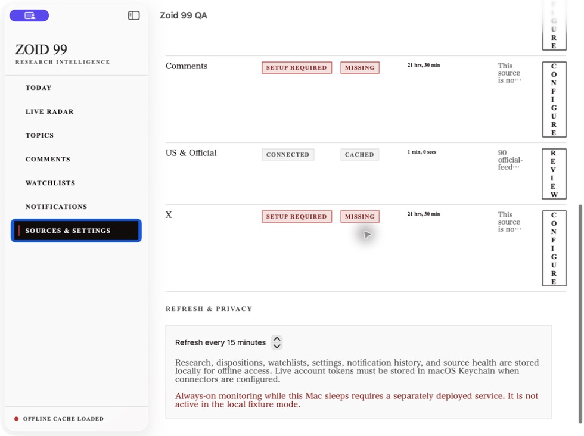

# Wave 2A ingestion and synchronization proof

Validation completed on 2026-07-24.

The live smoke command was:

```sh
ZOID99_RUN_LIVE_SPINE=1 \
ZOID99_API_BASE_URL=http://127.0.0.1:8099 \
ZOID99_API_TOKEN=[configured local token] \
swift test --filter LivePublicFeedTests/testRealOfficialFeedReachesBackendAndMacOSBootstrap
```

The exact proof line was:

```text
LIVE_SPINE_PROOF endpoint=http://127.0.0.1:8099 items=90 first=https://openai.com/index/health-in-chatgpt collectedAt=2026-07-23T21:33:01Z
```

The selected test completed with one passing test and no failures in 1.140 seconds.

The test collected up to 30 current items from each credential-free official starter source, sent normalized research batches through the authenticated ingestion API, persisted them in PostgreSQL, and decoded the backend bootstrap response through the macOS synchronization boundary.

The source URLs, publication timestamps, collection timestamps, original-source labels, verification labels, scoring output, and notification decisions were retained.

The backend returned 90 opportunities to the macOS-facing API without fixture or invented records.

The native app was launched against the same backend and exercised with macOS Computer Use.

The Sources and Settings ledger showed `US & Official`, `Connected`, `Cached`, and `90 official-feed items collected with source links and timestamps` after the follow-up conditional refresh.



The follow-up state is correctly labeled `Cached` because the backend and official feeds were unchanged after the successful live collection.
