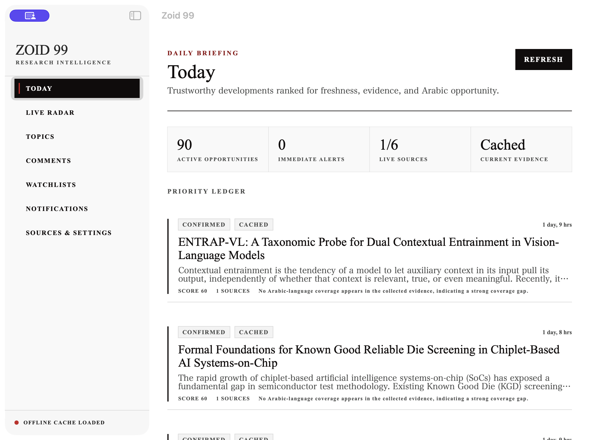
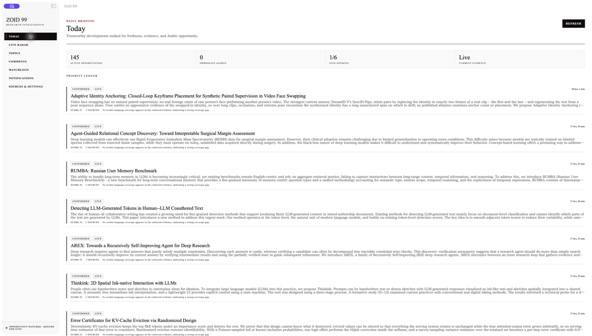
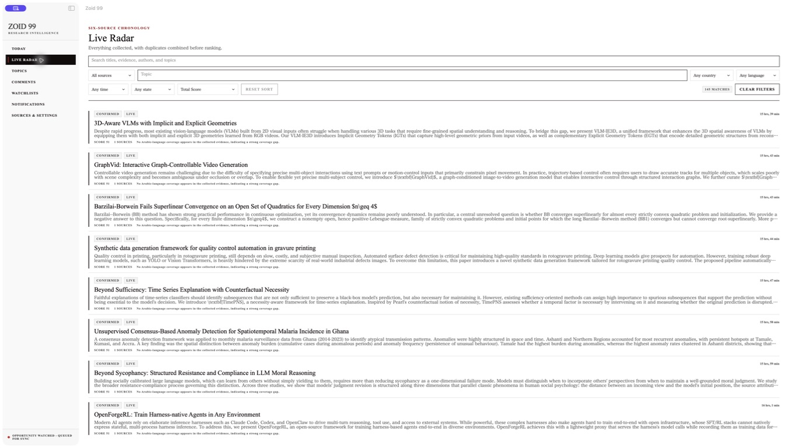

# Zoid 99

<p align="center">
  
</p>
<p align="center">
  
</p>
<p align="center">
  
</p>

Native macOS research intelligence that finds Arabic AI content opportunities — what the world is shipping, what Arabic audiences want, and where the coverage gap is.

Built for an Arabic AI video creator who needs one research ledger instead of six tabs. It does not write scripts, publish, or reply.

- Watch YouTube, official feeds, comments, and (when connected) Trends, Instagram, and X
- Cluster source items into stories, then score opportunities for freshness, momentum, and Arabic coverage gap
- Keep a watchlist of creators, keywords, countries, and languages
- Open a research brief with sources, timeline, and uncertainty — not a generated script
- Store YouTube credentials in macOS Keychain; official RSS/Atom/GitHub feeds need no account

## Try it

Needs macOS 14+ and Swift 5.10 tools.

```sh
swift run Zoid99
```

The first run uses deterministic fixtures. Complete setup to enter the research ledger.

```sh
swift test
```

Release build and signing notes: [`docs/RELEASING.md`](docs/RELEASING.md). Backend and live-connector runbook: [`docs/local-setup.md`](docs/local-setup.md).

## How it works

SwiftUI macOS app plus an optional PostgreSQL backend in `backend/`. Credential-free official feeds work without env vars. YouTube collection uses a Keychain API key or OAuth for owned channels. Google Trends, Instagram, and X stay setup-required until their connectors have evidence. Always-on monitoring while the Mac sleeps needs a separately deployed service. There is no Zoid 99 login.

---

Built by [Ziad Ahmed](https://github.com/Ziad-NasrEldin) at [MaVoid](https://mavoid.com).

[Website](https://mavoid.com) · [LinkedIn](https://linkedin.com/in/ziad-ahmed-634202332) · [GitHub](https://github.com/Ziad-NasrEldin)
